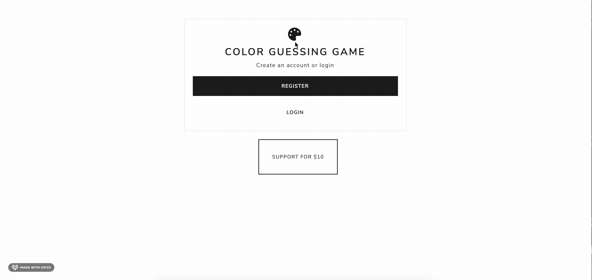
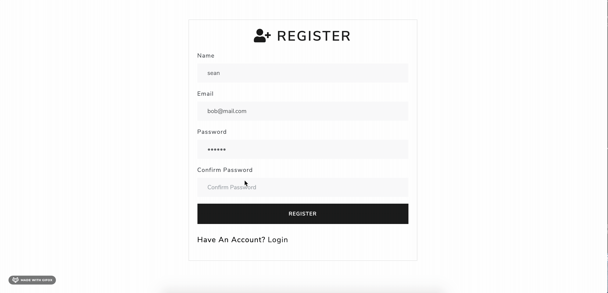
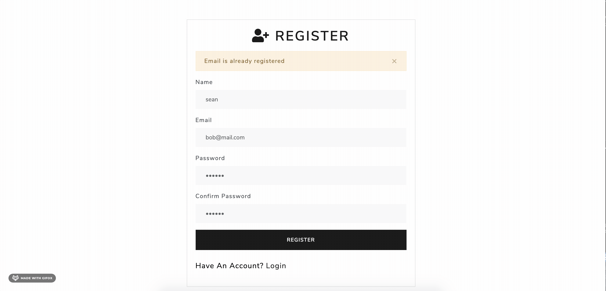
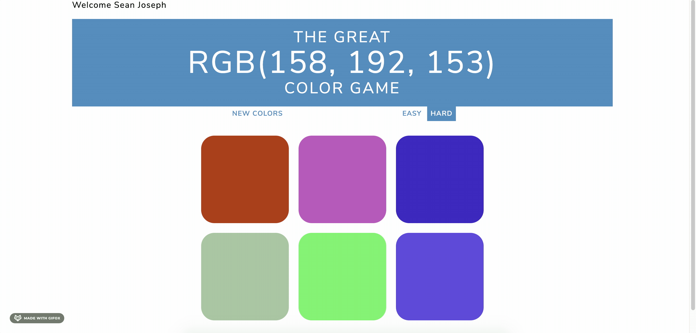
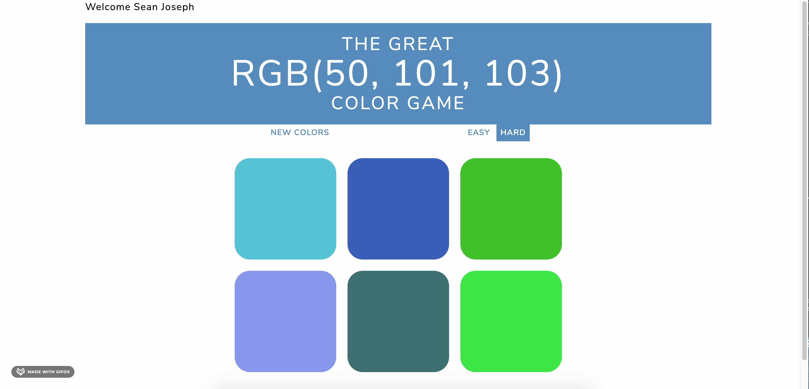

# ColorGame

This is a Node.js/Express web app game used to guess the RGB color. I used passport.js to authenticate users.
I used mongodb to store users information. And I also utilized the stripe API to mimic accepting payments. 

 Above you will see the stripe API usage 

 Above you will see the mongodb usage. Note that the user is unable to sign in because they have already registered

 Above you will see mongodb as well as passportjs to authenticate the user and sign them in.

Above you will see the actual game play. The user is asked what the RGB value is and the user is given six options on easy mode and 3 on easy mode. They are then tasked with selecting the correct color 

 Finally you will see the logout functionality 

